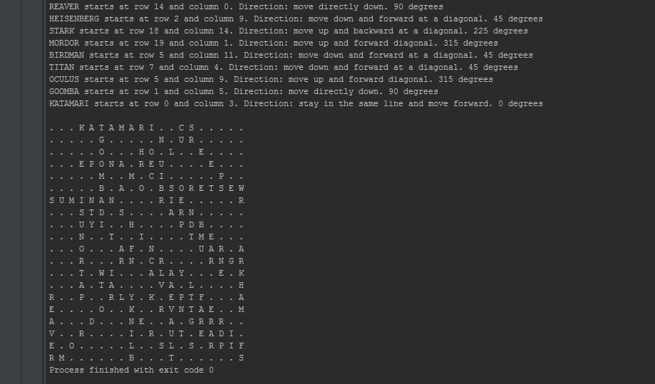

Harrison McGuire - IGN's Code-Foo 2015 Submission
=============

Hey IGN, my name is Harrison McGuire and I would to be apart of your code foo program this summer. Below in this readme I have answers and links to the questions, but for the best viewing experience you could visit my code foo website here http://harrison1.github.io/code-foo-2015/ . 

But in case you don't want to visit the website, I'll put all the information here in the readme. I got the idea for the website from looking at Jeremy Week's past submission, I thought it was a excellent way to package a submission. Thanks for the tip.

Question 1. Video Submission
=============
Visit the link below to view my submssion video Youtube. I wasn't sure if you wanted it less than 2 minutes (the website said less than 2) or between 2-5 minutes (the README said 2-5), so I kind of made it around 3 minutes. If you only watch a minute and half, that's super cool as well. Enjoy.
https://www.youtube.com/watch?v=4CqaxFrZv7c

Question 2. Ping Pong Challenge
=============
Hmmm...where to begin? I think I would just start by throwing ping pong balls at an airplane and see how far they bounced and wait until I get escorted out by airport security for sneaking onto the airstrip. No, that wouldn't be right nor would it answer the question. To solve the 747 challenge I would go down the list of finding the dimensions of needed properties and then see how they can be combined. Below is a list of my operations.

Step 1: How big is a ping pong ball?
Through a Google search I discovered that a ping pong ball has a diameter of 40mm. I am going to convert that to centimeters and then to inches. 40mm = 4cm and then 4cm = 1.5748in ~ let's approximate to 1.6in

Step 2: Find the volume of ping pong ball
The volume of a sphere is 4/3 x pi x r^3. We'll use the radius of 1.6/2 = 0/8 to find the volume of our ping pong ball. Volume = 4/3 x 3.14 x 0.8^3 = 2.14. We will use this volume in future steps.

Step 3: Account for empty space
Although the volume of a ping pong ball is 2.14in we need to account for empty space. I'm going to pretend each ping pong ball is inside an imaginary cube with the same length. The volume of a cube is a^3. So the imaginary cube's volume equals 1.6^3 = 4.096. Using this technique we will be putting each ball on top of one another, we will not be using the hexagonal method. Then, finding out how many ping pong balls can fit in a square foot, we find the volume of 12in cube then divide by 4.096. (12in x 12in x 12in)/4.096 = 422 ping pong balls. This number will be useful in later steps.

Step 4: The 747 - Find the dimensions
I'm going to split the 747 into 3 parts: 1 long cylinder and 2 cones that are placed on each end. After looking at the schematics, the cylinder will be 185ft long with a diameter of 30 ft and the cylinders will each be 20ft in height. The volume for a cylinder is pi x r^2 x h. Our volume equals 3.14 x 15^2 x185 = 131,000ft. The volume for a cone is pi x r^2 x h/3. Thus our volume for each cone equals 3.14 x 15^2 x 20/3 = 4712ft. We will use these volumes in the next step to find how many ping pong balls can fit inside the shapes and that will get us closer to the solution.

Step 5: Let's divide
Now since we have all the volumes let's multiply each volume by how many ping pongs can fit in a sq foot and then add the products. 1) Cylinder: 131,000ft x 422 = 55,282,000. 2) 2 Cones: 2(4712ft) x 422 = 3,976,928.

Step 6: The Final Sum
Now we simply add our products from the previous step. 1) Cylinder: 55,282,000 + 3,976,928 = 59,258,928.THE ANSWER IS About 59 Million ping pong balls. I'm making a bunch of assumptions in this problem. I am assuming that there are not any seats in the plane, cockpit controls, kitchen space, bathrooms, or cabinets. I am strictly assuming the plane is empty and I can only put balls in the main part of the plane; so I am assuming I can't put balls in the engine or inside the tires, etc.

Bonus - Step 7: Anvil Drop
Drop a gigantic anvil onto all the ping pong balls to flatten all the balls and that approximately increase the sum by a multiple of 5.

Bonus - Step 8: Wood Chipper
To finally get out all your frustration on this problem put all the ping pong balls in a wood chipper and rip them all the shreds. Then multiply the sum by 50...and then just go play a game of ping pong with your buddy and then relax on a double decker couch.

Question 3. Word Search Challenge
=============
The word search was a lot of fun to solve. I coded the program in java and below you will find a screen shot of the solution. The solution can be found in the Wordsearch folder.

Question 4. API Display List
=============
I created the program in Java that displays the list of videos and articles using IGN's API. I parsed through the JSON data using the org.json package. Below you will find screenshots of how the solution appears. The solution can be found in the IGNJSONRequest folder.

Question 5. App that uses the API and matches the design
=============
Using IGN's provided API I tackled the challenge by making an Android app that mimics the design of the provided screenshot. I pulled the JSON data using volley for speed and efficiency. I matched the design to fit the provided screenshot. Below you will find screenshots of the app. The solution can be found in the IGN_API_Android folder.

*quick note: the images show the footer with a divder, the footer divider has since been disabled.  

Bonus Question. Programmatically Make a Battleship Game
=============
The battleship game was a lot of fun to make. I created the game in java and it has one user controlled player and one AI controlled opponent that will put your skills to the test. The program takes a lot of code and a lot of checks and balances. Anyways, I hope you enjoy playing the game, I put some jokes in to hopefully increase the fun factor. The game is played entirely in the console. Below you'll find screenshots of the game. The solution can be found in the Battleship folder.

